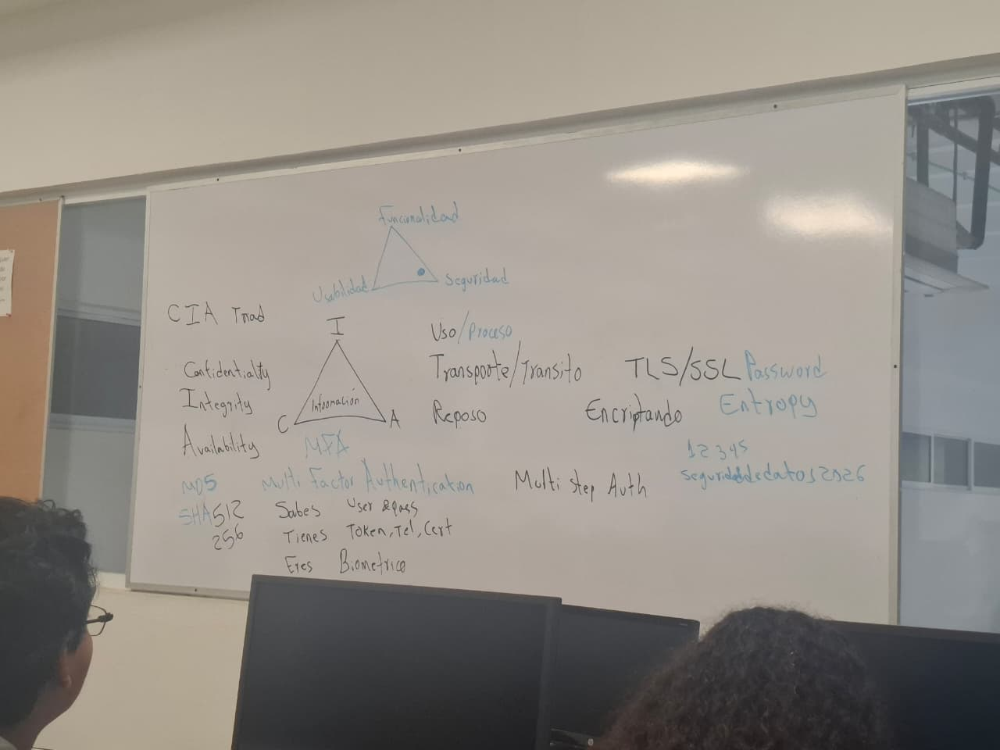

# Bitácora de Seguridad de Datos

## Clase 1 - 19/01/2026

En la primera clase seguridad de datos se explicó el triángulo CIA, que contiene Confidentiality, Integrity y Availability, estas tres partes conforman el modelo fundamental de seguridad de la información. En español sería: Confidencialidad, Integridad y Disponibilidad.  Su objetivo es proteger los datos contra accesos no autorizados, alteraciones y pérdidas, garantizando un manejo seguro y funcional de la información en cualquier organización. Cada uno tiene un significado:
- Confidencialidad:  Asegura que solo las personas autorizadas tengan acceso a los datos. Implica evitar la divulgación no autorizada de información confidencial.
- Integridad:  Garantiza que los datos sean fiables, precisos y no hayan sido modificados ni alterados por usuarios no autorizados, manteniendo la consistencia de la información.
- Disponibilidad:  Asegura que los sistemas, aplicaciones y redes funcionen correctamente y estén accesibles para los usuarios autorizados cuando los necesiten. 

  

Luego, tenemos otro triángulo que podemos llamarlo "Triángulo de la funcionalidad", esto quiere decir que su objetivo es equilibrar esos tres aspectos al desarrollar un software, sistema o producto tecnológico, etc. Es muy importante porque existen muchos ejemplos en el que muchos creadores se inclinan más de un lado o lados, perdiendo o disminuyendo un aspecto que es de mucha utilidad.

Teniendo en cuenta ambos triángulos, continuamos con las siguientes definiciones:
- Multi Factor Authentication (MFA): Es un método de seguridad que requiere que un usuario proporcione dos o más pruebas distintas (factores) para verificar su identidad antes de concederle acceso a una cuenta o sistema. Estos factores se dividen en tres categorías principales: 
Algo que sabes: Como una contraseña o un PIN.
Algo que tienes: Como un teléfono móvil, un token de seguridad o una tarjeta inteligente.
Algo que eres: Información biométrica, como una huella digital o un escaneo facial.

